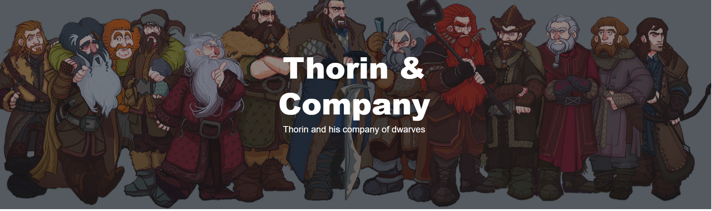
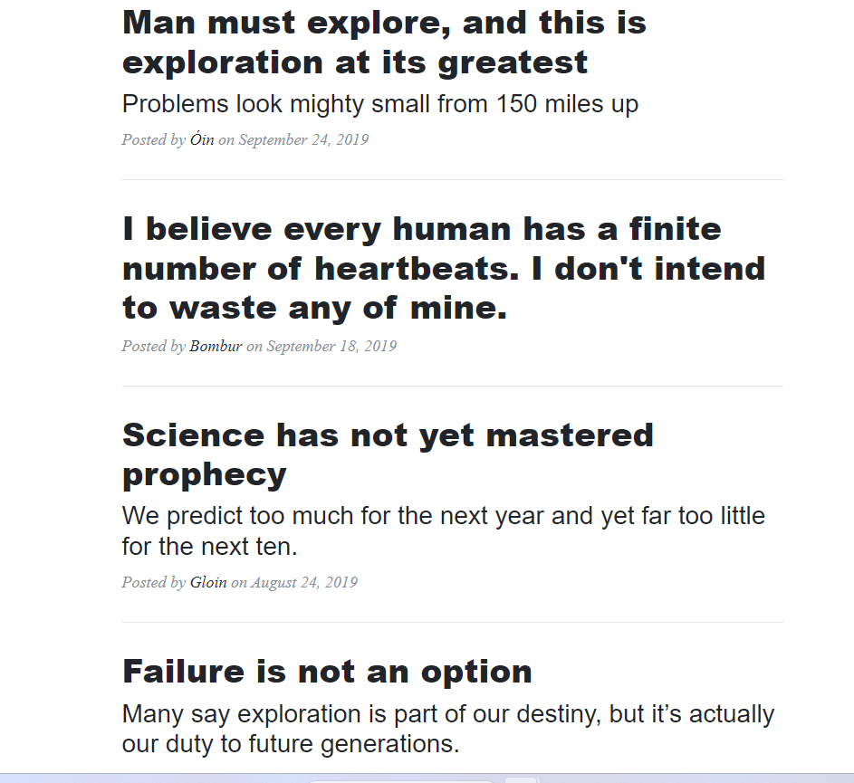
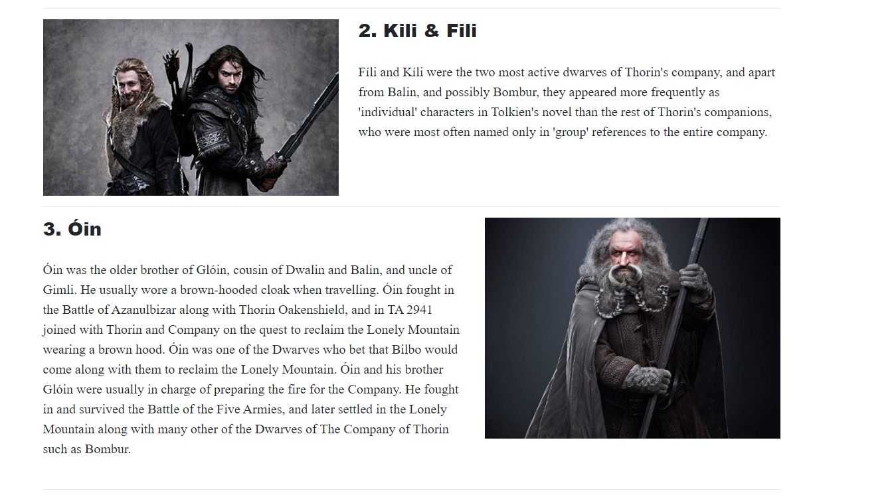
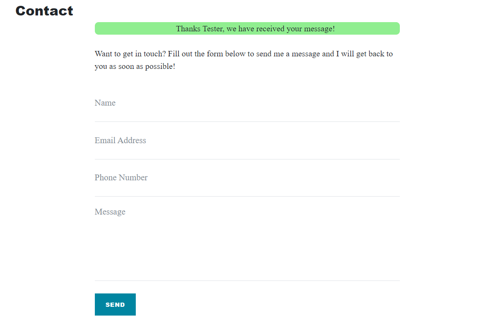

# Thorin & Company

Thorin & Company is a Lord of the Rings blog created with Flask and is a Walkthrough Project from the Code Institutes Fullstack Developer Program.

[Deployed Project Link](https://flask-tnc.herokuapp.com/)

## Features

### Existing Features

- **Navigation Bar**

  - Featured on all pages, the full responsive navigation bar includes links to home, about contact us and careers.
  - This section will allow the user to easily navigate from page to page across all devices.

- **The Cover Image**

  - The cover image alongside the navbar is displayed atop every page of the website, displaying the dwarves of the company.

- **Home Page**

  - The hompage lists all posts from most recent and descending,
  - The posts are currently palceholder links as there is no post detail page.
  - Displays the Author and Date Posted.

- **About Page**

  - The Company members images and a paragraph of their history
  - The images are linked and not downloaded, given the sample project nature of the website, so they might not be displaying properly as links change
  - Images and Paragraphs are programmatically swapped every other and the information and links are stored in a json file and not hardcoded into the website, for ease of updating.

- **Contact Us**

  - Form for contacting the website, not hooked up to an email right now, but is a posibility.
  - User Feedback when Form is submitted, no validation currently.

- **Careers**

  - The Careers page is not populated with any info so a picture is not provided.

- **The Footer**

  - The footer section includes a copyright and a placeholder name.

### Features Left to Implement

- Individual blog entry pages for entire posts.

## Testing

### Validator Testing

- HTML
  - No errors were returned when passing through the official [W3C validator](https://validator.w3.org/nu/?doc=https%3A%2F%2Fflask-tnc.herokuapp.com%2F)
- CSS
  - No errors were found when passing through the official [(Jigsaw) validator](https://jigsaw.w3.org/css-validator/validator?uri=https%3A%2F%2Fflask-tnc.herokuapp.com%2F&profile=css3svg&usermedium=all&warning=1&vextwarning=&lang=en)
- Python
  - Auto PEP8 was installed and used throughout the project, all issues were fixed as they appeard.

## Deployment

- add prebuild script
- add Procfile
- deploy to Heroku

### Content

- The theme used for the project was [Clean Blog](https://startbootstrap.com/theme/clean-blog) from [StarBootstrap](https://startbootstrap.com/)

### Media

- The [image](https://www.deviantart.com/art-calavera/art/The-Hobbit-Thorin-and-Company-341472935) used for the banner was published on Deviant Art by [Art-Calavera](https://www.deviantart.com/art-calavera/gallery)
- The images used in the about section were taken from the [LOTR Fandom](https://lotr.fandom.com/wiki/Main_Page) wiki.
